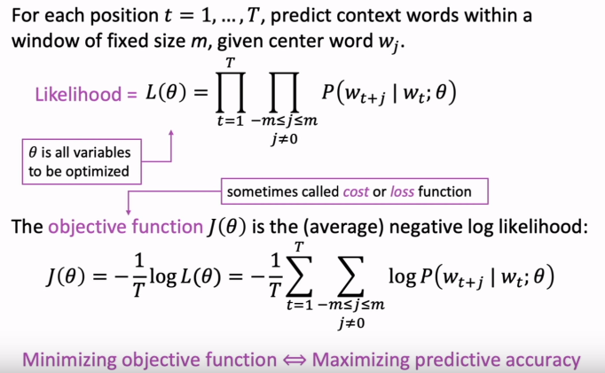
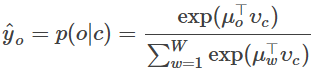
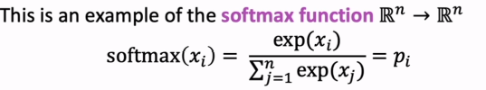
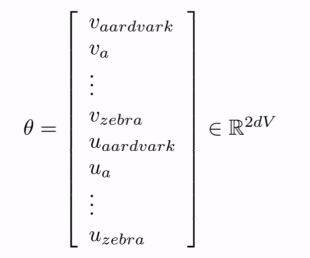

# WordNet
a thesaurus containing lists of **synonym** sets and **hypernyms**(上下位词)

- missing nuance (only correct in some contexts)
- missing new meanings of words
- subjective
- requires human labor to create and adapt
- unable to compute accurate word similarity

# One-Hot  

no natural notion of similarity of one-hot vectors

# Word2Vec

## Ideas

- center word: C, context words: O
- use the similarity of word vector for c and o -> calculate the probability of o given c
- keep adjusting the word vectors to maximize the probability

## Theory

### cost function and prediction function

then for a center word c and a context word o:

 	

softmax:

### optimize the value of parameters to minimize loss

- every word has two vectors: $u_o$ and $v_c$

  

- according to $\theta$, gradient descent

# Conclusion

1. Start with **random** word vectors with big big corpus

2. **Iterate** through each word in the whole corpus

3. Try to predict surrounding words of the center word using word vectors:

   

4. **Learning**：update vectors so they can predict actual surrounding words better (minimize the cost function)

5. get word vectors