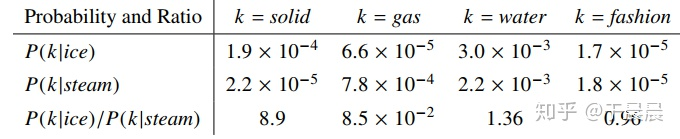

# Stochastic Gradient Descent

## Why

$J(\theta)$ is a function of all windows in the corpus

derivative is expensive to compute

## Solution

Repeatedly sample windows, and update after each one, or each small batch

# Two model

## Skip-grams (SG)

predict context words given center word

## Continuous Bag of Words (CBOW)

predict center word from (bag of) context words

# Negative Sampling

 Main idea:

train binary logistic regressions for a true pair versus several noise pairs

不同于原本每个训练样本更新所有的权重，负采样每次让一个训练样本仅仅更新一部分的权重，这样就好降低梯度下降过程中的计算量。

# Co-occurrence matrix

- window
- full document
- ​

# GLOVE

- SVD (dimensional reduction) co-occurrence matrix

- 单词的词向量学习应该跟词共现概率的比率有关，而不是他们的概率本身。

  ​